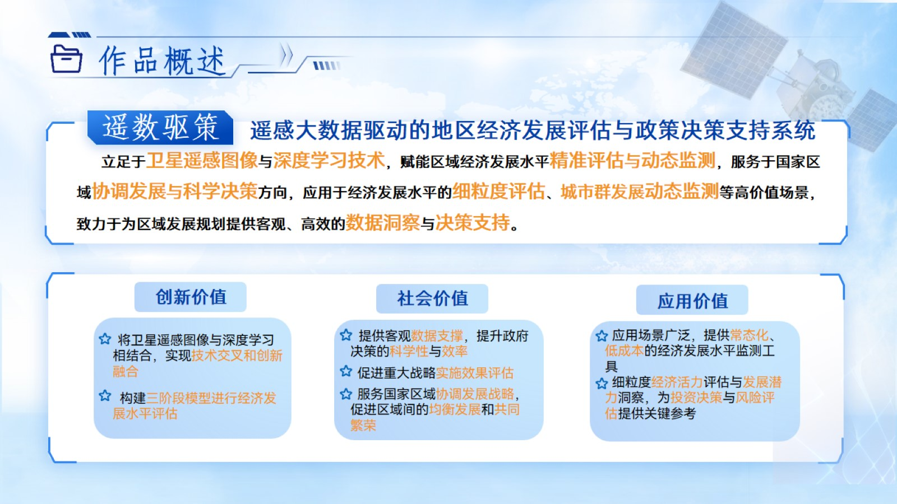
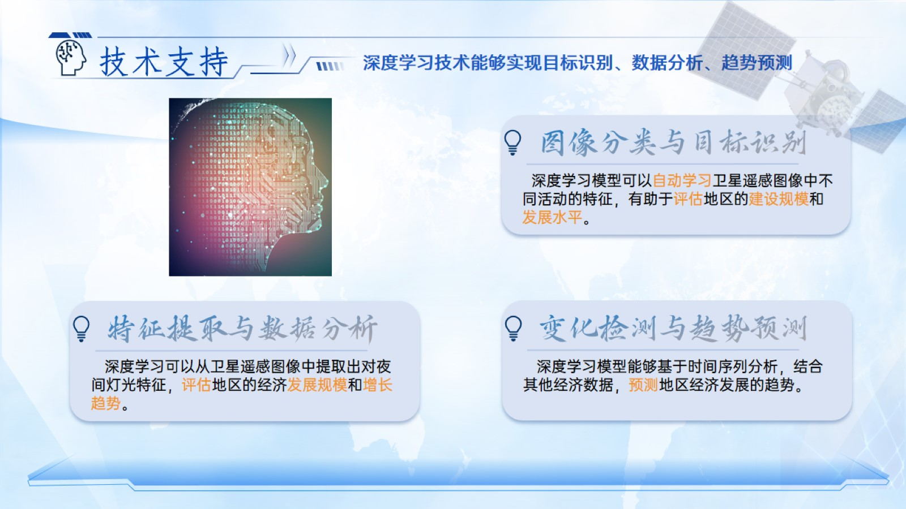

# 基于卫星图像的人机协同经济发展水平测量

> 第17届中国大学生计算机设计大赛 人工智能应用-人工智能实践赛 作品

> **遥数驱策** 是一款结合卫星遥感图像与深度学习技术，致力于提供低成本、高效的地区经济发展评估与政策决策支持的系统。该系统能够为区域经济提供细粒度的评估与动态监测，支持科学决策与投资参考。

> 可以访问我们的 [作品主页](https://wisdomgo.github.io/Distant-numbers-drive-strategies.github.io/) 来了解更多信息。

&nbsp;&nbsp;&nbsp;&nbsp;本作品基于遥感大数据与深度学习技术，专为区域经济发展评估设计，旨在为地方政府、科研机构及企业提供准确且即时的经济发展动态监测工具。

- 经济发展水平评估是国家区域协调发展与政策决策的核心支撑工具；

- 当前传统方法在偏远地区的评估面临滞后性与低准确性问题；

- 国家正在推进多项技术措施来解决这些问题，尤其是卫星遥感图像与人工智能技术的结合，提供了新的突破点；
 
- 现有经济发展评估方法的主要痛点：
  - **数据滞后**，传统方法依赖人工统计，导致难以应对快速变化的经济形势；
  - **信息更新慢**，难以快速响应局部地区的动态变化；
  - **数据质量差**，许多地区的统计数据不够准确和全面；
  - **计算资源不匹配**，传统方法的计算需求和效率问题仍未解决；

- **遥数驱策** 提供了解决方案，通过高频采集和深度学习分析，为经济发展评估提供准确性与时效性的保证。

&nbsp;&nbsp;&nbsp;&nbsp;我们设计了一套基于遥感图像的全新经济发展评估体系，结合深度学习技术，能够实时评估地区的经济发展水平，并支持政策决策与资源分配。

&nbsp;&nbsp;&nbsp;&nbsp;与传统方法相比，**遥数驱策** 利用了卫星遥感图像和深度学习算法的结合，提升了整体评估的准确性与时效性，提供了全面且细粒度的经济发展数据支持。

### 核心功能

#### 卫星图像数据获取与处理

- 使用 Microsoft Planetary Computer API，收集覆盖四川省的60个区块的卫星图像数据，涵盖2020至2024年的数据，数据总量约55GB；
- 使用多线程和MPI加速计算，优化了数据的爬取和处理效率，显著提高了数据获取速度。

#### 四分类模型训练与图像标注

- 采用深度学习技术，对卫星图像进行四分类：城市、乡村、山地和高原；
- 使用大模型API自动化标注，结合本地知识和专家评估，提高了标注的准确性。

#### 经济发展水平评分模型

- 使用多阶段经济评估模型，结合ResNet-18分类器和DeepCluster聚类方法，优化了数据的聚类和分析；
- 在第二阶段，通过POG生成与加权算法进一步优化经济发展评估的准确性；
- 最终通过多任务学习和分布式计算，提高了模型的预测能力和泛化能力。

### 系统实现

&nbsp;&nbsp;&nbsp;&nbsp;系统设计方面，我们将图像分割与数据处理结合，实现了全流程的自动化与高效运行，确保了数据更新的及时性与评估结果的准确性。

### 产学研合作

&nbsp;&nbsp;&nbsp;&nbsp;目前，本项目已获得1项专利、3项软件著作权，成功发表1篇学术论文，并实现了2个原创数据集的构建与应用。

&nbsp;&nbsp;&nbsp;&nbsp;项目由深圳英飞拓智能技术有限公司提供硬件支持，助力技术研发，并在深圳湾超级总部基地等多个园区进行了应用推广，取得了显著的社会效益和科技示范效果。

## 作者的话
    以上是本作品的全部介绍，欢迎大家star支持！

    遥数驱策 将继续为智能安防与区域经济发展评估提供创新解决方案，为国家经济政策与社会安全作出贡献。